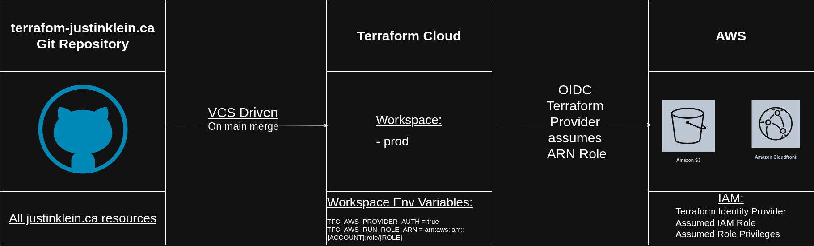

# Terraform/AWS Infrastructure Overview
## Author: Justin Klein
## Last Updated: January 29th, 2026

### What does this repo do?
This repository contains a **production-ready** Infrastructure as Code (IaC) solution for deploying a portfolio of web applications. It uses a **Monolithic** Terraform architecture to manage multiple sites (including `justinklein.ca` and its subdomains) from a single control plane.

The stack is **serverless**, **secure**, and **cost-optimized**:
- **S3 + CloudFront** — Global CDN for high-performance static hosting.
- **Route 53 + ACM** — Custom DNS and automatic SSL certificate management.
- **OIDC Identity Federation** — **Zero long-lived credentials**. Terraform Cloud authenticates to AWS using short-lived dynamic tokens.
- **Terraform Cloud (GitOps)** — Deployments are triggered automatically via Git commits, strictly separating the "Control Plane" (Identity) from the "Data Plane" (Resources).

### High-Level Architecture
The infrastructure is split into two distinct layers to solve the "Chicken-and-Egg" security problem:

1.  **Bootstrap Layer (Local Execution):** A one-time setup that configures the **Identity Access Management (IAM)**. It creates the OIDC Trust relationship that allows Terraform Cloud to talk to AWS.
2.  **Production Layer (Terraform Cloud):** The active workspace that manages the actual application resources (S3, CloudFront, DNS records). It runs inside a strictly scoped "Least Privilege" role created by the bootstrap layer.

#### Diagram:

If you're looking for an **in-depth technical breakdown** of the OIDC configuration and module architecture, please read [TECHNICAL_README.md](./TECHNICAL_README.md).